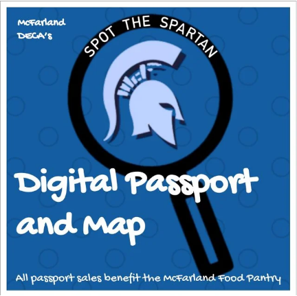

# Scavenger Society

This repository is for my final project in Madison College's Enterprise Java Class.

### Problem Statement

In trying to achieve a combination of objectives - preserve history, promote local business and attractions, encourage 
social interaction, and provide a different kind of entertainment option - the Scavenger Society Web App will be a streamlined
option in the scavenger hunt software space. Simple UI and functions. Usable via the web without downloading. It may not be
extravagant aesthetically, but using the app will be simple and fast so you can get back to hunting.

With Scavenger Society you can Create Local, City, State, Nation, or Worldwide Scavenger Hunts or do the Hunting yourself!
Track your Hunt location activity or show off your personal progress. Report difficulty ratings or problems with your hunt.

The space does have some very established, similar product offerings:
* goosechase | https://www.goosechase.com/
* Actionbound | https://en.actionbound.com/
* scavify | https://www.scavify.com/

For the first iteration, Scavenger Society will model an example after the Village of McFarland's
Spot the Spartan Scavenger Hunt hosted by the local DECA Chapter.

MVP: http://www.spartanheadquarters.org/store/p133/Spot_the_Spartan_Passport.html

Screenshots:

(See User Stories for Future Iterations)

### Design
* [User Stories](DesignDocuments/userStories.md)
* [Application Flow](DesignDocuments/applicationFlow.md)
* [Database Design](DesignDocuments/databaseDiagram.md)

### User Interfaces
* [Home Page](DesignDocuments/Home%20Page.png)
* [Sign Up](DesignDocuments/Sign%20Up.png)
* [Sign In](DesignDocuments/Sign%20In.png)
* [New Hunt](DesignDocuments/New%20Hunt.png)
* [New Point](DesignDocuments/New%20Point.png)
* [Hunt Summary](DesignDocuments/Hunt%20Summary.png)
* [Point Summary](DesignDocuments/Point%20Summary.png)
* [View/Edit Hunt](DesignDocuments/View_Edit%20Hunt.png)
* [View/Edit Point](DesignDocuments/View_Edit%20Point.png)
* [New Difficulty Note](DesignDocuments/New%20Update.png)
* [About Scavenger Society](DesignDocuments/About.png)
* [User Profile](DesignDocuments/User%20Profile.png)

### Progress Documentation and Reflection
* [User Stories](DesignDocuments/userStories.md)
* [TimeLog](DesignDocuments/timeLog.md)

### Project Technologies/Techniques (Edit)

* Security/Authentication
    * Tomcat's JDBC Realm Authentication
* Database
    * MySQL 8.0.22
* ORM Framework
    * Hibernate 5
* Dependency Management
    * Maven
* Web Services consumed using Java
    * NOAA for weather conditions at a trail location, including snow depth
* CSS
    * Bootstrap or Materialize (tbd)
* Data Validation
    * Bootstrap Validator for front end
    * Explore Hibernate's validation
* Logging
    * Log4J2
* Hosting
    * AWS
* Independent Research Topic/s
    * CI tools in AWS
    * Materialize
    * Google Maps API
    * Hibernate Validation
    * Hibernate Search
* Project Lombok
* Unit Testing
    * JUnit tests to achieve 80%+ code coverage
* IDE: IntelliJ IDEA